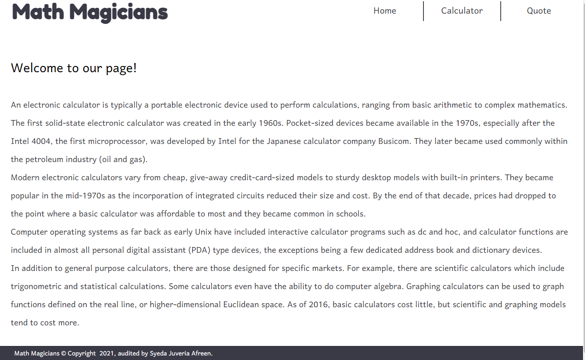
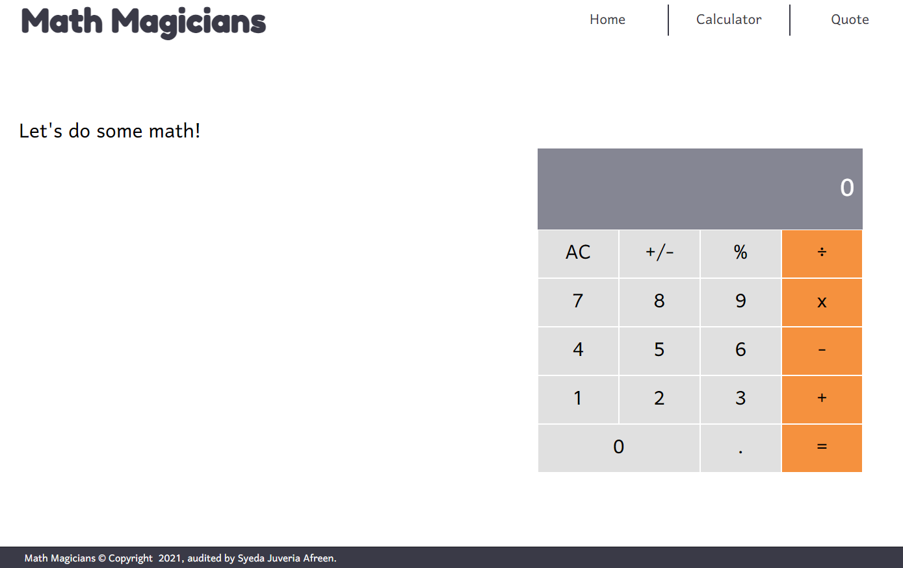
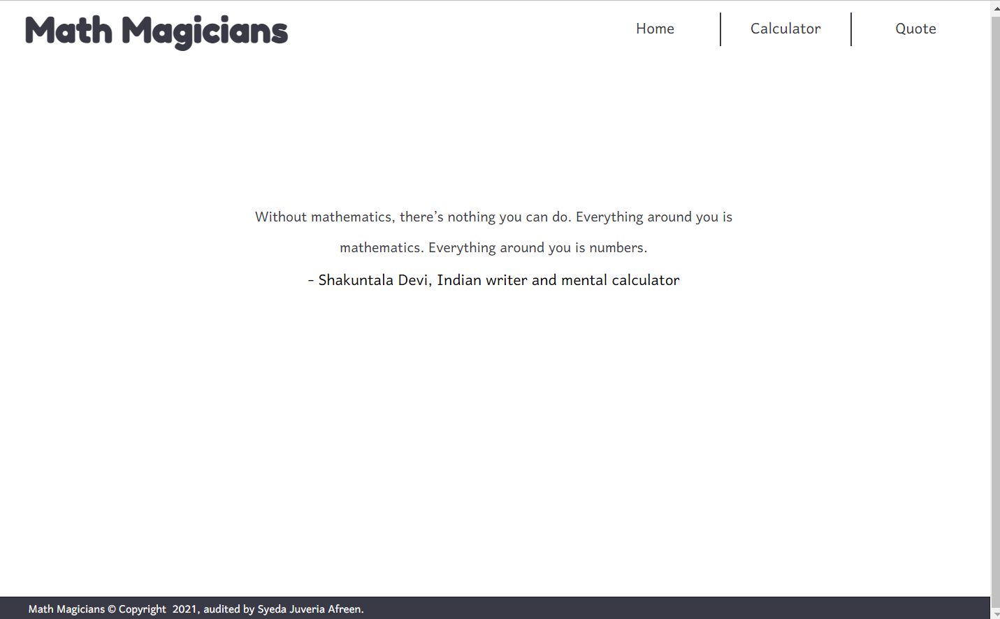

# Math-Magicians
Math magicians is a website for all fans of mathematics. It is a Single Page App (SPA) that allows users to make simple calculations and read a random math-related quote.

This project is part of the Microverse curriculum Module 3 Block 1. The main objective is about building your web application using React.





## Built With

- Html/Css
- JavaScript
- React

## Additional Tools

- Webhint
- Stylelint
- Eslint
- Lighthouse
- Webpack

## Getting Started

To get a local copy of this project:

Clone this repository or download the Zip folder:
```
https://github.com/sja-thedude/Math-Magicians.git
```
 
In the project directory, you can run:

### `npm start`

### `npm test`

### `npm run build`

### `npm run eject`

### `npm run build` fails to minify

## Authors

👤 **Syeda Juveria Afreen**

- GitHub: [@github](https://github.com/sja-thedude)
- Twitter: [@twitter](https://twitter.com/sja_thedude)
- LinkedIn: [LinkedIn](https://www.linkedin.com/in/syeda-juveria-afreen-23165898/)

## 🤝 Contributing

Contributions, issues, and feature requests are welcome!
Feel free to check the [issues page](https://github.com/sja-thedude/Math-Magicians/issues).

## Show your support

Give a ⭐️ if you like this project!

## Acknowledgments

- This project is part of week 1 of module 3 in the Microverse study program.
- Thanks to the Microverse team for the great curriculum.
- Thanks to Code Reviewers for the insightful feedback.
- A great thanks to My coding partners, morning session team, and standup team Partners for their contributions.
